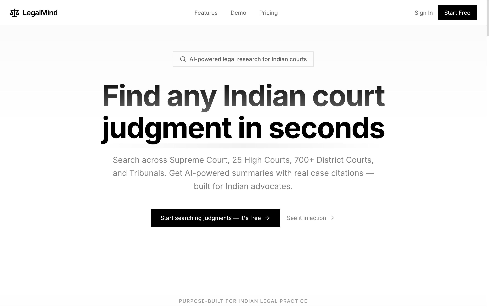
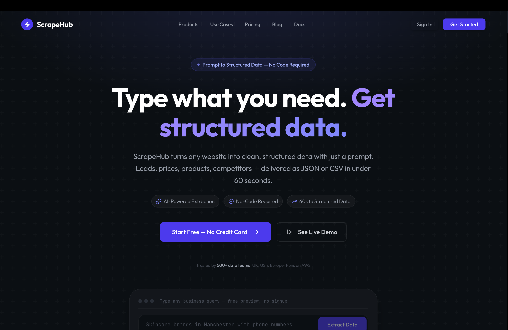
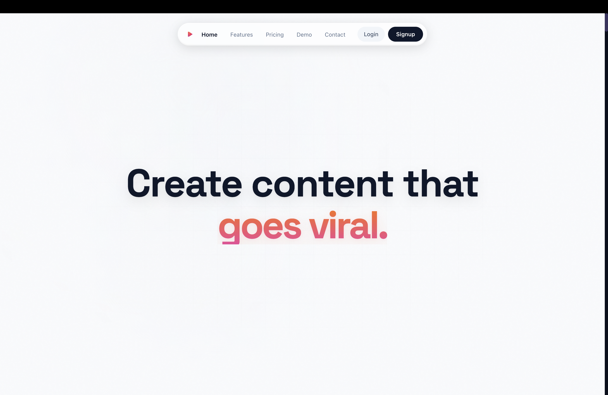
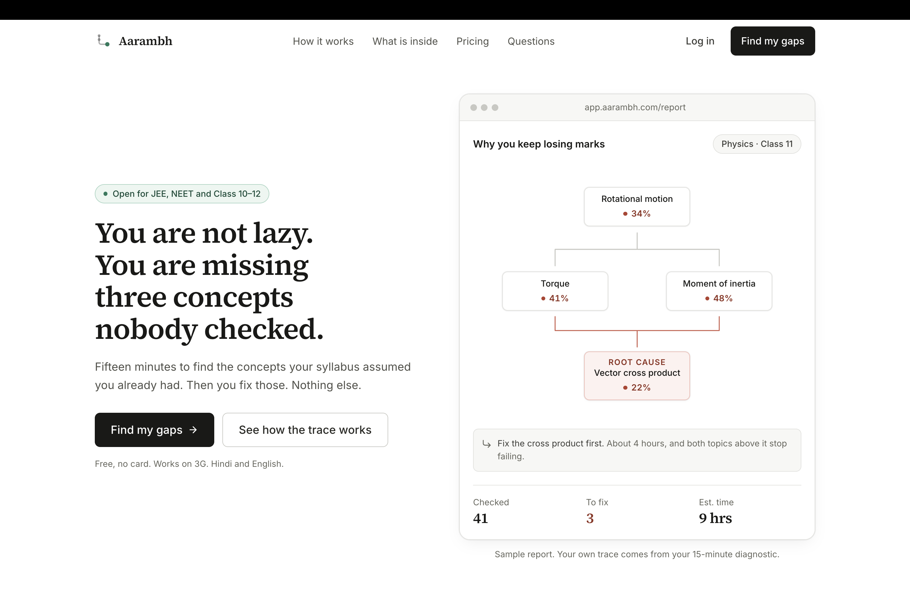

# Anshuman Parmar

**AI Engineer | Python Backend | Technical Team Lead**

I build and operate production LLM systems: RAG pipelines, multi-agent workflows on LangGraph,
and browser automation infrastructure running at scale on AWS.

 

 

Gwalior, India &nbsp;|&nbsp; open to relocation and remote

 

---

 

## Products

Commercial products. Closed source, live in production.

<table>
<tr>
<td width="50%" valign="top">

### [LegalMind](https://legal.anshumansp.com)

**AI legal research for Indian courts.**

Judgment search and cited-answer research across Supreme Court, High Court, and District Court records. I built the ingestion and chunking pipeline, RAG retrieval with cross-encoder re-ranking, per-matter data scoping, and an LLM-as-judge harness that scores citation accuracy against a labelled set.

</td>
<td width="50%" valign="top">

### [ScrapeHub](https://scrape.anshumansp.com)

**Competitive intelligence and web data platform.**

Natural-language-to-structured-data pipeline. Scheduled competitor scans on AWS, change detection across runs, and generated intelligence briefs. I built the Playwright rendering layer, the distributed job scheduler, and the credit-metered API.

</td>
</tr>
<tr>
<td width="50%" valign="top">

### [KreatorOS](https://creative.anshumansp.com)

**AI content platform for Indian-language creators.**

Speech-to-text captioning across Hindi and 10+ Indian languages, automated clip extraction from long-form video, and scheduled multi-platform publishing. I built the transcription and alignment pipeline and the YouTube OAuth integration.

</td>
<td width="50%" valign="top">

### [Aarambh](https://aarambh.anshumansp.com)

**AI learning platform for students.**

Adaptive practice and explanation generation for exam preparation, with per-student progress tracking and difficulty calibration.

</td>
</tr>
</table>

 

---

 

## Stack

**AI and LLM systems**

RAG, vector search, embeddings, semantic chunking, hybrid retrieval, cross-encoder re-ranking, MCP, LLM evaluation

 

**Backend**

REST, WebSockets, APScheduler, Redis queues and pub/sub, event-driven architecture, microservices

 

**Cloud and DevOps**

EC2, EKS, ECR, Lambda, S3, RDS, SQS, SNS, Kinesis Firehose, CloudWatch, Route 53, VPC, IAM, KEDA, HPA, Prometheus, Loki

 

**Data and automation**

DynamoDB, Pinecone, ChromaDB, Puppeteer, distributed scraping infrastructure, Next.js, Tailwind CSS, Redux

 

---

 

## Writing

Hindi-language technical content on AI tooling, agent frameworks, and developer workflows.

 

---

 

## Activity

<!--
  Keep these two URLs exactly as they are. The custom bg_color/title_color/theme variants
  return an error card, and a failed fetch gets cached by GitHub's camo image proxy,
  so the card stays broken for hours even after the service recovers.

  If the public instance is paused (503 DEPLOYMENT_PAUSED), deploy your own in ~10 min:
    1. Fork github.com/anuraghazra/github-readme-stats
    2. Import the fork into Vercel and deploy
    3. Replace github-readme-stats.vercel.app below with your-instance.vercel.app
-->

